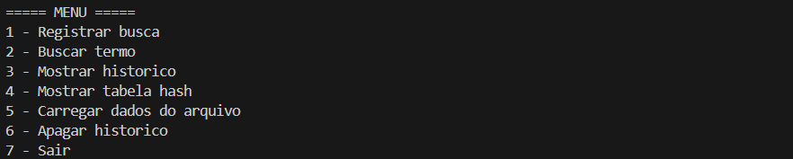
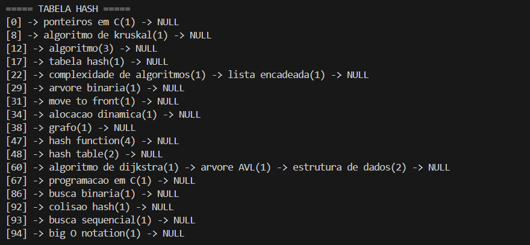
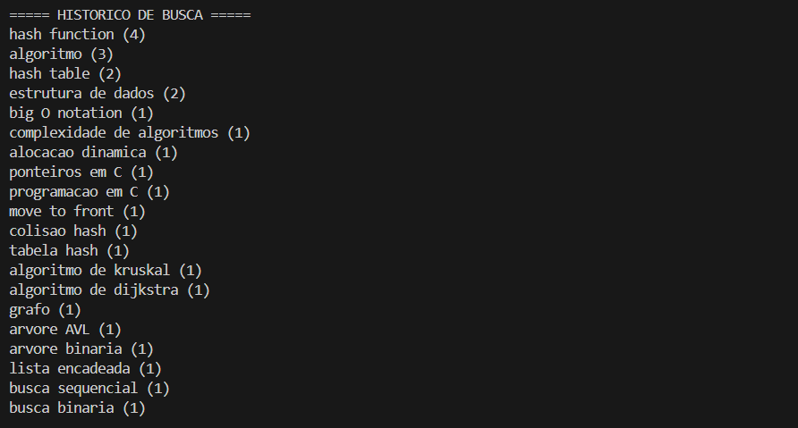

# G21_Busca_EDA2_2026.1

Número da Lista: 1
Conteúdo da Disciplina: Algoritmos de Busca (Estruturas de Dados II)

## Alunos

| Matrícula | Aluno                            |
| --------- | -------------------------------- |
| 202016604 | João Lucas Miranda de Sousa                   |

## Sobre

Este projeto implementa um sistema simples de histórico de buscas com o objetivo de aplicar conceitos estudados na disciplina de Estruturas de Dados II. Para armazenar os termos pesquisados é utilizada uma Tabela Hash com tratamento de colisões por listas encadeadas. Além disso, o sistema utiliza a técnica Move-To-Front (MTF), que move os termos mais recentemente buscados para o início do histórico.

## Screenshots



*Menu do sistema de busca.*



*Visualização da tabela hash.*



*Histórico de termos pesquisados.*


## Instalação

## Linguagem Utilizada

O projeto foi desenvolvido utilizando a linguagem C.

## Requisitos do Sistema

Para executar o programa, é necessário:

- Compilador C (GCC recomendado)
- Sistema operacional: Linux, Windows ou macOS
- Terminal ou prompt de comando
- Arquivo de dados opcional: `dados_busca.txt` para carregar termos de busca

## Compilar o Programa

No terminal, navegue até a pasta do projeto e execute:

```
gcc busca.c -o busca
```

Isso irá gerar o executável do programa.

## Uso

Após compilar, execute o programa com o comando:

```
./busca
```

Ao executar, será exibido um menu com as seguintes opções:

1 - Registrar busca  
2 - Buscar termo  
3 - Mostrar histórico  
4 - Mostrar tabela hash  
5 - Carregar dados do arquivo  
6 - Apagar histórico  
0 - Sair  

### Descrição das Opções

**Registrar busca**  
Permite inserir um novo termo de busca no sistema.

**Buscar termo**  
Procura um termo já registrado. Caso ele exista, sua frequência é atualizada e ele sobe para o início do histórico utilizando Move-To-Front.

**Mostrar histórico**  
Exibe os termos pesquisados na ordem do histórico.

**Mostrar tabela hash**  
Mostra como os termos estão distribuídos na tabela hash.

**Carregar dados do arquivo**  
Carrega termos de busca a partir do arquivo `dados_busca.txt`.

**Apagar histórico**  
Remove todos os termos armazenados e libera a memória utilizada.

## Outros

- **Estruturas de dados utilizadas:**
    - Tabela Hash
    - Lista encadeada
    - Move-To-Front (MTF)
- **Funcionalidades implementadas:**
    - Inserção de termos de busca
    - Busca de termos
    - Atualização da frequência de buscas
    - Organização do histórico por Move-To-Front
    - Tratamento de colisões na tabela hash
    - Leitura de dados a partir de arquivo
    - Limpeza do histórico